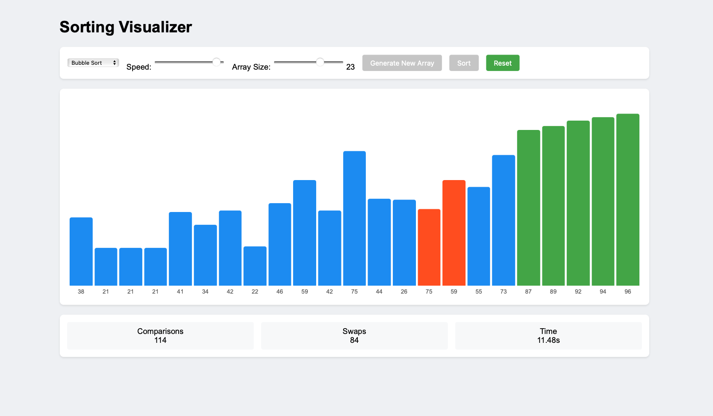

# Sorting Visualizer  

An **interactive web application** built to visualize sorting algorithms in real time.  
It provides an engaging way to understand how different algorithms work under the hood, step by step, with animations and live statistics.  

---

## ✨ Key Features  

- **Supported Algorithms**  
  - Bubble Sort  
  - Selection Sort  
  - Insertion Sort  

- **Interactive Controls**  
  - Adjust sorting **speed**  
  - Change **array size**  
  - Generate new random datasets  

- **Visualization Highlights**  
  - Bars represent array elements with visual cues for comparisons, swaps, and sorted states  
  - Real-time statistics (comparisons, swaps, elapsed time)  

- **Responsive & Lightweight**  
  - Works directly in the browser  
  - No external dependencies required
 
---

## 📸 Preview  



---

## 🚀 Getting Started  

### Prerequisites  
- A modern web browser (Chrome, Firefox, Edge, Safari).  

### Installation & Run  
Clone the repository and open it locally:  

```bash
git clone https://github.com/arinjainn/sortingVisualizer.git
cd sortingVisualizer
